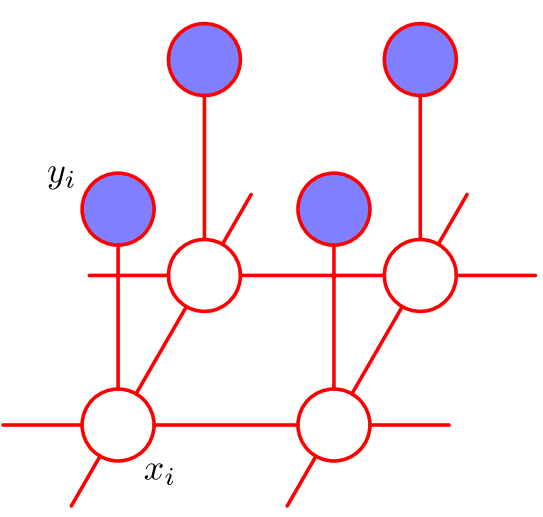

# Image Denoising with Probabilistic Graphical Modelling

Image Source: Pattern Recognition and Machine Learning by Christopher Bishop

Probabilistic graphical models are a powerful tool to develop models that describe complex interactions in the language of probability. They consists of *nodes*, which are random variables, and connections between them which can be directed or undirected. Models of the first kind are also called *Bayesian networks*, and models of the second kind are *Markov random fields*. 

## Image Denoising Model

In this notebook, an example of an undirected graphical model (or Markov random field) is displayed. It makes use of *maximal cliques* and *potential functions* to obtain the most likely configuration of original pixel values x_i by observing a noisy version of an image y_i. 

## Further Reads

Although this algorithm can be understood without the framework of graphical models, I would highly recommend reading the respective chapter in the book *Pattern recognition and machine learning* by Christopher Bishop. The problem statement of this notebook can be found as an example in this book as well.
